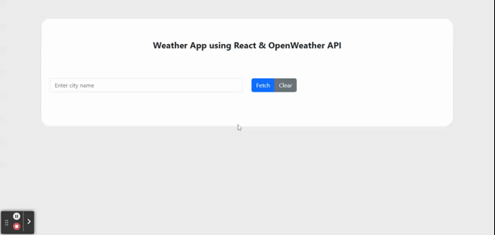

# react-weather-application using functional components (hooks)
 A simple code for weather app, developed using #React and open weather #API, #formik and #yup used for form validation.

## Live app on stackblitz 
[https://stackblitz.com/edit/react-weather-app-openweather?file=src%2FApp.js](https://stackblitz.com/edit/react-weather-app-openweather?file=src%2FApp.js)

# Kickstart
1. checkout the repository
2. cd app
3. npm install
4. Edit /app/src/AppConfig.js and change the API key - You can get your API key from - https://home.openweathermap.org/api_keys 
5. npm start

## Demo - Weather API integration

